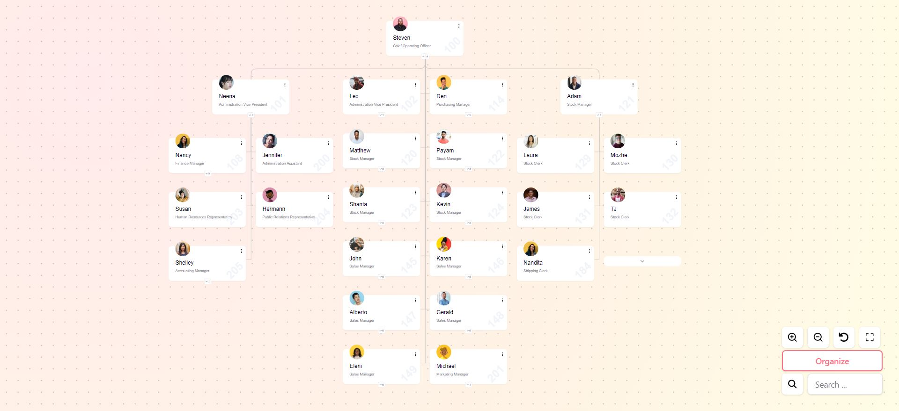

## پیش نمایش پروژه



# نمایش ساختار سازمانی

### **ویژگی‌ها**

* **نمایش سلسله مراتبی:** نمایش واضح ساختار سازمانی به صورت درختی
* **قابلیت باز و بسته شدن زیرمجموعه‌ها:** امکان مشاهده جزئیات هر بخش به صورت جداگانه
* **افزودن و حذف افراد:** حذف و ایجاد فرد جدید در ساختار سازمانی
* **ابزارهای تعاملی:** امکان بزرگنمایی، کوچک‌نمایی، تنظیم اندازه صفحه و جستجوی افراد
* **استفاده از فایل CSV برای دیتا و اطلاعات دیتابیس**

### **تکنولوژی‌های مورد استفاده**

* **Next.js:** فریمورک React برای ساخت وب‌اپلیکیشن‌های سمت سرور
* **Tailwind CSS:** فریمورک CSS برای طراحی سریع و آسان رابط کاربری
* **shadCN:** مجموعه کامپوننت‌های UI برای ایجاد رابط‌های کاربری مدرن
* **D3.js:** کتابخانه جاوا اسکریپت برای ایجاد گراف‌ها و نمودارهای تعاملی
* **TypeScript:** زبان برنامه‌نویسی برای تایپ‌چک کردن کد و افزایش قابلیت اطمینان
* **zod:** کتابخانه اعتبارسنجی داده‌ها در TypeScript
* **react-hook-form:** کتابخانه مدیریت فرم‌ها در React

### **نحوه کار**

1. **ایجاد دیاگرام:** کاربر با استفاده از رابط کاربری، نودهای جدید را اضافه کرده و روابط بین آن‌ها را تعریف می‌کند.
2. **ویرایش دیاگرام:** کاربر می‌تواند ساختار دیاگرام را تغییر دهد و با استفاده از منو موجود در هر کارت به اضافه کردن زیرمجموعه یا حذف کاربر اقدام کند.
3. **تعامل با دیاگرام:** کاربر می‌تواند با استفاده از ابزارهای تعاملی، دیاگرام را بزرگنمایی، کوچک‌نمایی و پیمایش کند.
4. **جستجوی افراد:** کاربر می‌تواند با وارد کردن نام یا عنوان، افراد مورد نظر را در دیاگرام پیدا کند.

### **دستورالعمل‌های نصب و اجرا**

1. **Clone Repository:**
   ```bash
   git clone https://github.com/Khosefin/company_diagram.git
   ```
2. **Install Dependencies:**
   ```bash
   cd your-repo
   npm install
   ```
3. **Run:**
   ```bash
   npm run dev
   ```

---